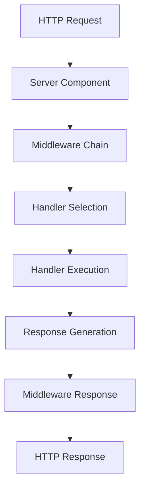

# Framework Concepts and Core Guidance

## Overview

Comprehensive guidance for explaining userver framework concepts, architecture, and core principles to developers seeking to understand the framework's design and implementation patterns.

## Core Framework Concepts

### Asynchronous Programming Model

**Coroutine-Based Architecture**
```cpp
// userver uses coroutines for asynchronous operations
engine::TaskWithResult<std::string> AsyncOperation() {
    // All I/O operations are non-blocking
    auto result = co_await database_.ExecuteAsync(query);
    co_return ProcessResult(result);
}
```

**Key Principles**
- **Non-blocking I/O**: All I/O operations are asynchronous and coroutine-based
- **Efficient Threading**: Small number of execution threads, high concurrency
- **Transparent Async**: Developers write straightforward code, framework handles async complexity
- **Context Switching Avoidance**: Minimizes CPU-consuming OS context switches

### Component System Architecture

**Component Lifecycle**
```yaml
component_lifecycle:
  registration: "Components registered in ComponentList"
  initialization: "Components initialized in dependency order"
  configuration: "Static and dynamic configuration applied"
  operation: "Components handle requests and background tasks"
  shutdown: "Graceful shutdown in reverse dependency order"
```

**Component Types**
```cpp
// HTTP Handler Component
class HelloHandler final : public server::handlers::HttpHandlerBase {
public:
    static constexpr std::string_view kName = "handler-hello";
    using HttpHandlerBase::HttpHandlerBase;
    
    std::string HandleRequest(server::http::HttpRequest& request,
                            server::request::RequestContext&) const override;
};

// Client Component
class DatabaseClient final : public components::ComponentBase {
    // Database client implementation
};
```

### Task Processor System

**Task Processor Types**
```yaml
task_processors:
  main-task-processor:
    purpose: "CPU-bound coroutine tasks"
    characteristics: "High concurrency, non-blocking operations"
    worker_threads: "Typically 4-8 threads"
  
  fs-task-processor:
    purpose: "Filesystem and synchronous operations"
    characteristics: "Blocking operations allowed"
    worker_threads: "Typically 1-2 threads"
```

**Usage Guidelines**
- **Main Task Processor**: All async operations, HTTP handlers, database queries
- **FS Task Processor**: File I/O, synchronous system calls, blocking operations
- **Custom Task Processors**: Specialized workloads with specific requirements

## Framework Architecture Patterns

### Request Processing Flow

**HTTP Request Lifecycle**


**Key Components**
1. **Server Component**: Manages listening sockets and connection handling
2. **Middleware Chain**: Cross-cutting concerns (auth, logging, metrics)
3. **Handler**: Business logic implementation
4. **Response Processing**: Content-Type, headers, status codes

### Configuration Management

**Static Configuration**
```yaml
# Static config - startup configuration
components_manager:
  task_processors:
    main-task-processor:
      worker_threads: 4
  components:
    server:
      listener:
        port: 8080
    handler-hello:
      path: /hello
      method: GET,POST
```

**Dynamic Configuration**
```cpp
// Runtime configuration changes
void UpdateConfiguration() {
    // Dynamic configs can be changed without restart
    // Examples: timeouts, feature flags, connection limits
}
```

### Database Integration Patterns

**Connection Management**
```cpp
// PostgreSQL example
class DatabaseService {
    storages::postgres::ClusterPtr pg_cluster_;
    
public:
    engine::TaskWithResult<UserData> GetUser(int user_id) {
        auto result = co_await pg_cluster_->Execute(
            storages::postgres::ClusterHostType::kSlave,
            "SELECT * FROM users WHERE id = $1", user_id
        );
        co_return ParseUserData(result);
    }
};
```

**Transaction Handling**
```cpp
engine::TaskWithResult<void> UpdateUserData(const UserData& data) {
    auto transaction = co_await pg_cluster_->Begin(
        storages::postgres::ClusterHostType::kMaster,
        storages::postgres::TransactionOptions{}
    );
    
    co_await transaction.Execute(
        "UPDATE users SET name = $1 WHERE id = $2",
        data.name, data.id
    );
    
    co_await transaction.Commit();
}
```

## Core Development Concepts

### Synchronization Primitives

**Framework-Provided Synchronization**
```cpp
#include <userver/engine/mutex.hpp>
#include <userver/engine/condition_variable.hpp>

class ThreadSafeCounter {
    mutable engine::Mutex mutex_;
    int counter_ = 0;
    
public:
    void Increment() {
        std::lock_guard lock(mutex_);
        ++counter_;
    }
    
    int Get() const {
        std::lock_guard lock(mutex_);
        return counter_;
    }
};
```

**Key Principles**
- Use framework synchronization primitives, not OS primitives
- Avoid blocking operations in main task processor
- Prefer async patterns over synchronization when possible

### Error Handling Patterns

**Exception-Based Error Handling**
```cpp
// Custom handler exceptions
class ValidationError : public server::handlers::CustomHandlerException {
public:
    ValidationError() : CustomHandlerException(400, "Invalid input data") {}
};

std::string HandleRequest(server::http::HttpRequest& request,
                         server::request::RequestContext&) const override {
    auto data = request.GetArg("data");
    if (data.empty()) {
        throw ValidationError();
    }
    return ProcessData(data);
}
```

**Database Error Handling**
```cpp
try {
    auto result = co_await pg_cluster_->Execute(query, params...);
    co_return ProcessResult(result);
} catch (const storages::postgres::Error& e) {
    LOG_ERROR() << "Database error: " << e.what();
    throw server::handlers::InternalServerError();
}
```

### Logging and Tracing

**Structured Logging**
```cpp
#include <userver/logging/log.hpp>

void ProcessRequest(const std::string& user_id) {
    LOG_INFO() << "Processing request" 
               << logging::LogExtra::Key("user_id", user_id)
               << logging::LogExtra::Key("operation", "data_fetch");
    
    // Request processing logic
}
```

**Distributed Tracing**
```cpp
#include <userver/tracing/span.hpp>

engine::TaskWithResult<Data> FetchData(const std::string& key) {
    tracing::Span span("fetch_data");
    span.AddTag("key", key);
    
    auto result = co_await external_service_.GetData(key);
    span.AddTag("result_size", result.size());
    
    co_return result;
}
```

## Framework Integration Patterns

### HTTP Client Usage

**Async HTTP Requests**
```cpp
#include <userver/clients/http/client.hpp>

class ExternalApiClient {
    clients::http::Client& http_client_;
    
public:
    engine::TaskWithResult<ApiResponse> CallExternalApi(const Request& req) {
        auto response = co_await http_client_.CreateRequest()
            .post("https://api.example.com/endpoint")
            .data(req.ToJson())
            .timeout(std::chrono::seconds(5))
            .perform();
            
        co_return ParseApiResponse(response);
    }
};
```

### Cache Integration

**LRU Cache Usage**
```cpp
#include <userver/cache/lru_cache.hpp>

class DataCache {
    cache::LruCache<std::string, UserData> user_cache_;
    
public:
    engine::TaskWithResult<UserData> GetUser(const std::string& user_id) {
        if (auto cached = user_cache_.Get(user_id)) {
            co_return *cached;
        }
        
        auto user_data = co_await database_.FetchUser(user_id);
        user_cache_.Put(user_id, user_data);
        co_return user_data;
    }
};
```

### Metrics and Monitoring

**Custom Metrics**
```cpp
#include <userver/utils/statistics/metrics.hpp>

class ServiceMetrics {
    utils::statistics::Counter requests_total_;
    utils::statistics::Histogram request_duration_;
    
public:
    void RecordRequest(std::chrono::milliseconds duration) {
        requests_total_.Increment();
        request_duration_.Account(duration.count());
    }
};
```

## Best Practices Guidance

### Performance Considerations

**Efficient Async Patterns**
```cpp
// Good: Concurrent operations
engine::TaskWithResult<CombinedResult> ProcessConcurrently() {
    auto task1 = utils::Async("fetch_data1", []() { return FetchData1(); });
    auto task2 = utils::Async("fetch_data2", []() { return FetchData2(); });
    
    auto result1 = co_await task1;
    auto result2 = co_await task2;
    
    co_return CombineResults(result1, result2);
}

// Avoid: Sequential operations when concurrency is possible
engine::TaskWithResult<CombinedResult> ProcessSequentially() {
    auto result1 = co_await FetchData1();  // Waits unnecessarily
    auto result2 = co_await FetchData2();  // Could run concurrently
    co_return CombineResults(result1, result2);
}
```

**Resource Management**
```cpp
// RAII patterns for resource cleanup
class ResourceManager {
    std::unique_ptr<Resource> resource_;
    
public:
    ResourceManager() : resource_(std::make_unique<Resource>()) {}
    
    // Automatic cleanup on destruction
    ~ResourceManager() = default;
};
```

### Security Considerations

**Input Validation**
```cpp
std::string ValidateAndProcessInput(const std::string& input) {
    if (input.empty() || input.size() > MAX_INPUT_SIZE) {
        throw ValidationError("Invalid input size");
    }
    
    // Sanitize input
    auto sanitized = SanitizeInput(input);
    return ProcessSafeInput(sanitized);
}
```

**Authentication Integration**
```cpp
class AuthenticatedHandler : public server::handlers::HttpHandlerBase {
    std::string HandleRequest(server::http::HttpRequest& request,
                            server::request::RequestContext& ctx) const override {
        auto auth_token = request.GetHeader("Authorization");
        if (!ValidateToken(auth_token)) {
            throw server::handlers::Unauthorized();
        }
        
        return ProcessAuthenticatedRequest(request, ctx);
    }
};
```

## Concept Explanation Templates

### For Beginners
```markdown
# Concept Introduction Template:
1. **What it is**: Simple definition and purpose
2. **Why it matters**: Benefits and use cases  
3. **Basic example**: Minimal working code
4. **Next steps**: Related concepts to learn
5. **Resources**: Tutorial links and documentation
```

### For Intermediate Developers
```markdown
# Implementation Guidance Template:
1. **Core principles**: Key design decisions
2. **Implementation patterns**: Common approaches
3. **Configuration**: Setup and tuning
4. **Integration**: How it fits with other components
5. **Best practices**: Performance and maintainability
```

### For Advanced Users
```markdown
# Advanced Topics Template:
1. **Architecture details**: Internal mechanisms
2. **Customization**: Extension points and hooks
3. **Performance tuning**: Optimization strategies
4. **Troubleshooting**: Common issues and solutions
5. **Expert patterns**: Advanced usage scenarios
```

## Cross-Reference Integration

### Memory Bank Connections
```yaml
framework_concepts:
  component_system: "Detailed component patterns and lifecycle"
  async_programming: "Coroutine patterns and async best practices"
  service_patterns: "Service architecture and design patterns"
  troubleshooting_guide: "Common framework issues and solutions"
```

### Documentation Links
```yaml
official_references:
  component_system: "Component system documentation"
  synchronization: "Synchronization Primitives guide"
  task_processors: "Guide on TaskProcessor Usage"
  logging_tracing: "Logging and Tracing documentation"
  testing: "Unit Tests and Benchmarks guide"
```

## Response Guidelines for Framework Questions

### Concept Explanations
1. **Start with purpose**: Why this concept exists
2. **Show practical example**: Working code snippet
3. **Explain integration**: How it fits in the larger system
4. **Provide context**: When and why to use it
5. **Reference documentation**: Links for deeper learning

### Architecture Questions
1. **High-level overview**: System design principles
2. **Component interactions**: How parts work together
3. **Data flow**: Request/response lifecycle
4. **Configuration impact**: How settings affect behavior
5. **Scalability considerations**: Performance implications

### Implementation Guidance
1. **Pattern selection**: Choose appropriate approach
2. **Code examples**: Concrete implementation
3. **Configuration setup**: Required settings
4. **Testing strategy**: How to verify correctness
5. **Monitoring**: How to observe behavior in production